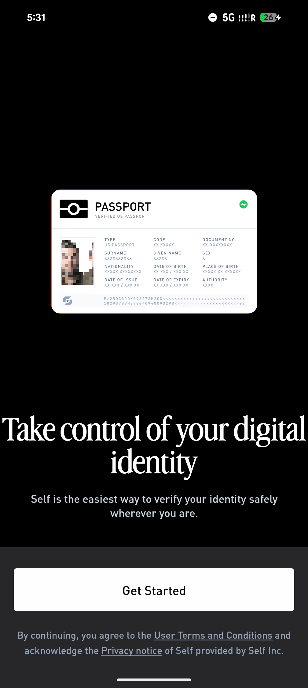
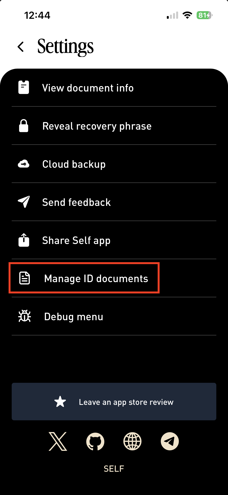
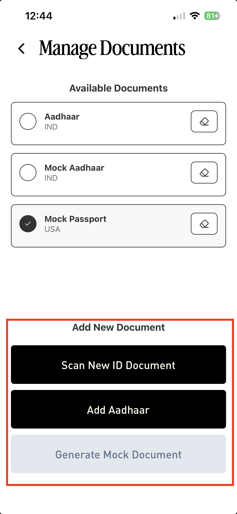

# Using mock passports

Mock passports are how you exercise verification end-to-end without a real passport. Useful for development, CI, and demos.

Mock passports only work against flows in your **test** environment (i.e. sessions created with an `sk_test_` key). They never verify against live flows. See [Test vs. live](../flows/test-vs-live.md).

## Generating a mock passport

To create a mock passport, on the Self app's first screen, tap 5 times with one finger on the **Passport** button.

<figure><figcaption></figcaption></figure>

This opens the mock-passport creation screen. Set the attributes you want to test against (nationality, age, OFAC status), then save.

To try the whole loop end-to-end without writing any code, open [playground.staging.self.xyz](https://playground.staging.self.xyz/), the staging playground accepts mock passports.

To stop using a mock passport, select a different document to use. If no other document is added yet, go to **Settings → Manage ID Documents.**

<figure><figcaption></figcaption></figure>

Click **Add New Document.**

<figure><figcaption></figcaption></figure>

If the document is already registered, it can be selected from the Home page.

<figure><figcaption></figcaption></figure>
