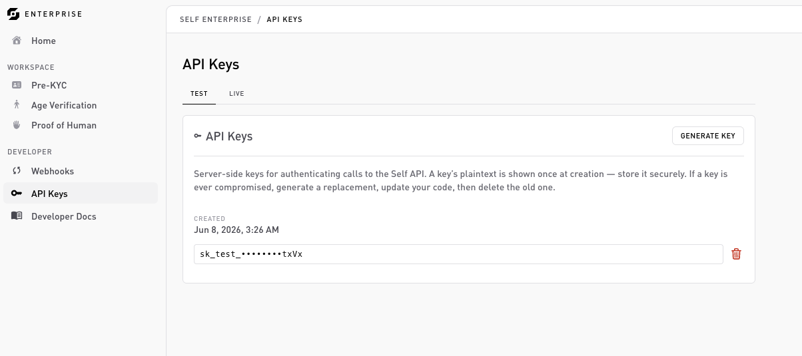

# API keys

API keys authenticate the SDK. They're org-scoped (not tied to a product), and you generate them on the **Developer → API keys** page.



## Generating a key

On the **Developer → API keys** page:

1. Pick the environment with the **Test | Live** tab strip. The list and the key you generate are scoped to the selected tab.
2. Click **Generate key** (top right) and confirm.

The key is **revealed once**, right after creation. Copy it immediately into your secret manager (GCP Secret Manager, AWS Secrets Manager, 1Password, and so on). Afterwards only a masked form (the last few characters) is shown, you can't retrieve the full key again.


You can hold at most **2 active keys per environment**. Once you hit the limit the button reads "Limit reached", revoke an old key to generate a new one. Generating and revoking keys is **owner/admin** only; members see a read-only list.


## Key shape

```
sk_test_…
sk_live_…
```

The prefix encodes the environment and is part of the credential format. A test key only creates sessions against test configurations, a live key only against live ones, with no cross-environment access. Detecting `sk_live_` in commits is a useful pre-push hook.

## Using a key

Hand it to the Enterprise SDK at initialization:

```ts
import { SelfClient } from '@selfxyz/enterprise-sdk';

const self = new SelfClient({ apiKey: process.env.SELF_API_KEY! });
```

The SDK uses it on every call to `sessions.create(...)` and `sessions.get(...)`. See the [SDK reference](../sdk/nodejs.md).

## Revocation

Revoke any key from the same **API keys** page. There's no undo, generate a new one if needed. The page lists your existing keys by their last few characters and when they were created.

## Security notes

* Don't put keys in front-end code. They authorize session creation, which costs money.
* Don't commit keys. Use environment variables and secret managers.
* If a service's key leaks, you only have to rotate that one.

## Related

* [SDK reference](../sdk/nodejs.md).
* [Test vs. live](../flows/test-vs-live.md): environments are baked into the key prefix.
