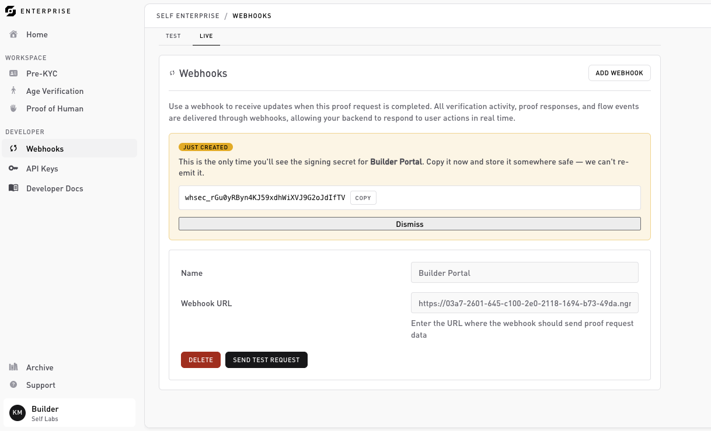

# Webhooks (dashboard)

**Developer → Webhooks**. Register the HTTPS endpoints Self posts events to. For the delivery model, signatures, retries, and payloads, see the [Webhooks section](../webhooks/overview.md).



## Stand up an endpoint first

When you add an endpoint, Self sends a **test event** to your URL and **only saves it if your endpoint returns `2xx`**. If the URL doesn't respond with `2xx` in time, nothing is saved and you get a "webhook test failed" error. So your endpoint has to be live and reachable **before** you add it.

A handler that just returns `200` is enough to get registered:

```ts
import express from 'express';

const app = express();

app.post('/webhooks/self', express.raw({ type: 'application/json' }), (req, res) => {
  res.sendStatus(200);   // accept the test event so the endpoint saves
});

app.listen(3000);
```

Don't try to verify the signature yet, you don't have the signing secret until the endpoint saves. Just return `200` for now. For local development, expose the URL publicly with a tunnel ([ngrok](https://ngrok.com), Cloudflare Tunnel, etc.).

## Add an endpoint

Click **Add webhook** and fill in:

* **Name**: a label for the endpoint.
* **Webhook URL**: the public HTTPS URL from above.
* **Environment**: `test` or `live` (defaults to test).

When you click **Test and save**, Self sends the test event and waits for the result:

* If your endpoint returns **`2xx`**, the endpoint is **saved** and the **signing secret** (`whsec_...`) is revealed **once**. This is the only time you'll see it, copy it into your secret manager as `SELF_WEBHOOK_SECRET`.
* If it returns a non-`2xx` or doesn't respond in time, the endpoint is **not saved** ("webhook test failed"). Fix the endpoint and add it again.

Every endpoint receives the `verification.completed` event; there's no per-endpoint event picker. Branch on `event.type` in your handler. See the [event catalog](../webhooks/events.md).

## Verify the signature

Now that the endpoint is saved and you have the `whsec_...` secret, replace the bare `200` with real signature verification so you only act on genuine events. See [Verify webhooks](../sdk/verify-webhooks.md).

## Managing endpoints

Each saved endpoint shows its name, URL, and environment, with a **Delete** action. Deleting stops delivery to that URL.

## Related

* [Webhooks: overview](../webhooks/overview.md): delivery, retries, and idempotency.
* [Signature verification](../webhooks/signature-verification.md): how to validate a delivery.
* [Event catalog](../webhooks/events.md): every event and its payload.
