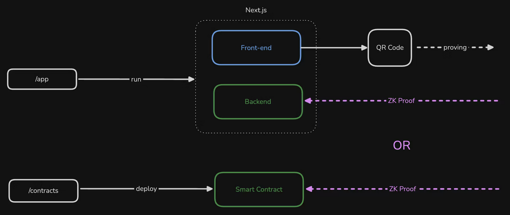

# Quickstart

> ⚠️ Forking the [boilerplate repo](https://github.com/selfxyz/self-integration-boilerplate) is a great starting point for your project to integrate Self. It contains a basic working example that demonstrates how to integrate Self. From this, you can add your own logic/requirements as needed.

## Before You Start

**New to Self Protocol?** We highly recommend watching our [ETHGlobal Buenos Aires Workshop](https://www.loom.com/share/8a6d116a5f66415998a496f06fefdc23) first. This essential workshop walks through the core concepts and provides a hands-on introduction to building with Self.&#x20;

### Examples

Working examples of Self Protocol integration are available to use as a foundation to build upon.

* [Airdrop](contracts/airdrop-example.md)
* [Happy Birthday](contracts/happy-birthday-example.md)
* [Soul Bound Token](https://github.com/selfxyz/self/blob/main/contracts/contracts/example/SelfPassportERC721.sol)
* [Cross Chain (LayerZero)](https://github.com/selfxyz/self-layerzero-example)
* [Cross Chain (Hyperlane)](https://github.com/selfxyz/self-integration-boilerplate/tree/hyperlane-example)

## Choose Your Verification Path

Every Self Pass integration has two parts: a **frontend** that displays a QR code (or deeplink) for users to scan with the Self app, and a **verification method** that checks the proof. You must choose one verification method:

| | Smart Contract Verification | Backend Verification |
|---|---|---|
| **How it works** | Proof is verified on-chain by the [IdentityVerificationHub](architecture/verification-hub.md) | Proof is verified on your Node.js server using `SelfBackendVerifier` |
| **Trust model** | Trustless — anyone can verify the result on-chain | Trust assumption — users trust your backend verifies correctly |
| **Best for** | DeFi, airdrops, token gates, on-chain access control | Web apps, APIs, off-chain services, rapid iteration |
| **Trade-offs** | Gas costs per verification; config changes require redeployment | No gas costs; easier to update; requires a running server |
| **Guide** | [Smart Contract Integration](contracts/basic-integration.md) | [Backend Integration](backend/basic-integration.md) |
| **Example** | [Boilerplate repo](https://github.com/selfxyz/self-integration-boilerplate) | [Backend branch](https://github.com/selfxyz/self-integration-boilerplate/tree/backend-verification) |


Both paths use the same frontend SDK (`@selfxyz/qrcode`) to display the QR code. The only difference is where verification happens.


## Choose Your Environment

| Environment | Documents | Network | `endpointType` | When to use |
|---|---|---|---|---|
| **Staging** | Mock passports | Celo Sepolia | `staging_celo` (contract) or `staging_https` (backend) | Development and testing |
| **Production** | Real passports | Celo Mainnet | `celo` (contract) or `https` (backend) | Live applications |


Mock passports only work with staging endpoints on Celo Sepolia. Real passports only work with production endpoints on Celo Mainnet. See [Using Mock Passports](using-mock-passports.md) for setup instructions.


### Key Concepts

* **`scopeSeed`** — A short string (max 31 ASCII characters) that uniquely identifies your application, e.g. `"my-airdrop-app"`. You pass this into your smart contract constructor as `scopeSeed`, and it gets hashed together with the contract address (using Poseidon) to produce the final `scope` — a uint256 value used in proofs to ensure nullifiers are unique to your app and prevent proof replay. Note: the frontend `SelfAppBuilder` currently names this field `scope`, but you are passing in the `scopeSeed` value.
* **`endpointType`** — Determines where the proof is sent and which network is used (see table above).
* **`endpoint`** — The destination address. For contract verification, this is your deployed contract address. For backend verification, this is your API URL.

## Overview

<figure><figcaption></figcaption></figure>

## Installation

Install the required frontend packages:



```bash
npm install @selfxyz/qrcode @selfxyz/core ethers
```



```bash
yarn add @selfxyz/qrcode @selfxyz/core ethers
```



```bash
bun install @selfxyz/qrcode @selfxyz/core ethers
```



**Package purposes:**

* `@selfxyz/qrcode`: QR code generation and display components
* `@selfxyz/core`: Core utilities including `getUniversalLink` for deeplinks
* `ethers`: Ethereum utilities for address handling

### Basic Usage

Here's a complete Next.js component example based on the workshop:

```javascript
'use client';

import React, { useState, useEffect } from 'react';
import { getUniversalLink } from "@selfxyz/core";
import {
  SelfQRcodeWrapper,
  SelfAppBuilder,
  type SelfApp,
} from "@selfxyz/qrcode";
import { ethers } from "ethers";

function VerificationPage() {
  const [selfApp, setSelfApp] = useState<SelfApp | null>(null);
  const [universalLink, setUniversalLink] = useState("");
  const [userId] = useState(ethers.ZeroAddress);

  useEffect(() => {
    try {
      const app = new SelfAppBuilder({
        version: 2,
        appName: process.env.NEXT_PUBLIC_SELF_APP_NAME || "My App",
        scope: process.env.NEXT_PUBLIC_SELF_SCOPE || "my-app",
        endpoint: `${process.env.NEXT_PUBLIC_SELF_ENDPOINT}`,
        logoBase64: "https://i.postimg.cc/mrmVf9hm/self.png",
        userId: userId,
        endpointType: "staging_https",
        userIdType: "hex",
        userDefinedData: "Hello World",
        disclosures: {
          //check the API reference for more disclose attributes!
          minimumAge: 18,
          nationality: true,
          gender: true,
        }
      }).build();

      setSelfApp(app);
      setUniversalLink(getUniversalLink(app));
    } catch (error) {
      console.error("Failed to initialize Self app:", error);
    }
  }, [userId]);

  const handleSuccessfulVerification = () => {
    console.log("Verification successful!");
  };

  return (
    <div className="verification-container">
      <h1>Verify Your Identity</h1>
      <p>Scan this QR code with the Self app</p>
      
      {selfApp ? (
        <SelfQRcodeWrapper
          selfApp={selfApp}
          onSuccess={handleSuccessfulVerification}
          onError={() => {
            console.error("Error: Failed to verify identity");
          }}
        />
      ) : (
        <div>Loading QR Code...</div>
      )}
    </div>
  );
}

export default VerificationPage;
```


If you instead want to use the Self App on a mobile then we check out the [use-deeplinking.md](use-deeplinking.md "mention") and [#usage-mobile](frontend/qrcode-sdk.md#usage-mobile "mention") sections!


### Verification Flow

The QR code component displays the current verification status with an LED indicator and changes its appearance based on the verification state:

1. **QR Code Display**: Component shows QR code for users to scan
2. **User Scans**: User scans with Self app and provides proof
3. **Verification**:
   1. Onchain Verification: Your smart contract receives the proof and verifies it on the Self VerificationHub contract.
   2. Backend Verification: Your API endpoint receives and verifies the proof
4. **Success Callback**: `onSuccess` callback is triggered when verification completes

## Add `SelfBackendVerifier` to your backend

If you want to verify your proofs with the backend verifier, then you would implement the following.

### Requirements

* Node v16+

### Install dependencies



```bash
npm install @selfxyz/core 
```



```bash
yarn add @selfxyz/core 
```



```bash
bun install @selfxyz/core 
```



### Set Up SelfBackendVerifier

```javascript
// app/api/verify/route.ts
import { NextResponse } from "next/server";
import { SelfBackendVerifier, AllIds, DefaultConfigStore } from "@selfxyz/core";

// Reuse a single verifier instance
const selfBackendVerifier = new SelfBackendVerifier(
  "my-app", // scope — must match the scope in your frontend SelfAppBuilder
  "https://your-app.com/api/verify", // your backend endpoint
  false, // mockPassport: false = production, true = staging/testnet
  AllIds,
  new DefaultConfigStore({
    minimumAge: 18,
    excludedCountries: ["IRN", "PRK", "RUS", "SYR"],
    ofac: true,
  }),
  "uuid" // userIdentifierType
);

export async function POST(req: Request) {
  try {
    // Extract data from the request
    const { attestationId, proof, publicSignals, userContextData } = await req.json();

    // Verify all required fields are present
    if (!proof || !publicSignals || !attestationId || !userContextData) {
      return NextResponse.json(
        {
          message: "Proof, publicSignals, attestationId and userContextData are required",
        },
        { status: 200 }
      );
    }

    // Verify the proof
    const result = await selfBackendVerifier.verify(
      attestationId,    // Document type (1 = passport, 2 = EU ID card, 3 = Aadhaar, 4 = KYC)
      proof,            // The zero-knowledge proof
      publicSignals,    // Public signals array
      userContextData   // User context data (hex string)
    );

    // Check if verification was successful
    if (result.isValidDetails.isValid) {
      // Verification successful - process the result
      return NextResponse.json({
        status: "success",
        result: true,
        credentialSubject: result.discloseOutput,
      });
    } else {
      // Verification failed
      return NextResponse.json(
        {
          status: "error",
          result: false,
          reason: "Verification failed",
          error_code: "VERIFICATION_FAILED",
          details: result.isValidDetails,
        },
        { status: 200 }
      );
    }
  } catch (error) {
    return NextResponse.json(
      {
        status: "error",
        result: false,
        reason: error instanceof Error ? error.message : "Unknown error",
        error_code: "UNKNOWN_ERROR"
      },
      { status: 200 }
    );
  }
}

```


The endpoint must be publicly accessible (not localhost). For local development, use ngrok to tunnel your localhost endpoint.


## Key Points

### Configuration Matching

Your frontend and backend configurations must match exactly:

```javascript
// Backend configuration
const verification_config = {
  excludedCountries: [],
  ofac: false,
  minimumAge: 18,
};

// Frontend configuration (must match)
disclosures: {
  minimumAge: 18,        // Same as backend
  excludedCountries: [], // Same as backend  
  ofac: false,           // Same as backend
  // Plus any disclosure fields you want
  nationality: true,
  gender: true,
}
```

## Next Steps

* [Disclosures](disclosures.md) — Full reference for all verification rules and disclosure fields
* [Deployed Contracts](contracts/deployed-contracts.md) — Hub addresses for Celo Mainnet and Sepolia
* [Using Mock Passports](using-mock-passports.md) — Test your integration without a real passport
* [Troubleshooting](troubleshooting.md) — Common errors and solutions
