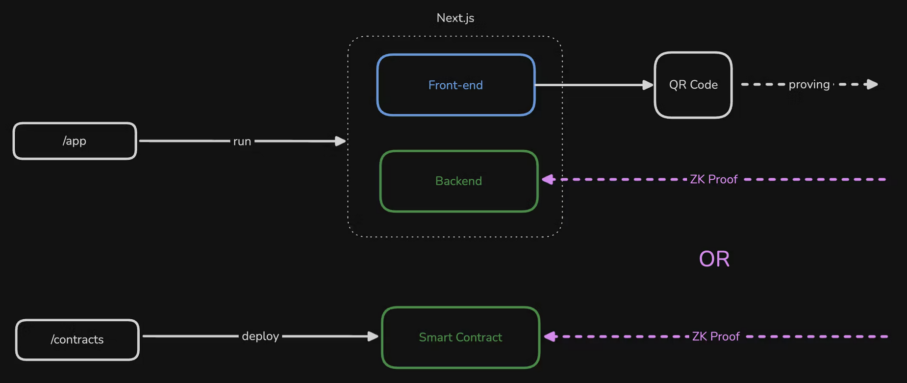

# Quickstart

> ⚠️ **Important**: The Self SDK is currently undergoing significant changes. This guide reflects the latest implementation. If you encounter issues, please check the [SDK repository](https://github.com/selfxyz/self) for updates.

## Before You Start

**New to Self Protocol?** We highly recommend watching our [ETHGlobal Buenos Aires Workshop](https://www.loom.com/share/8a6d116a5f66415998a496f06fefdc23) first. This essential workshop walks through the core concepts and provides a hands-on introduction to building with Self.

## Overview

To use Self in your web app, you will display QR codes to request proofs from your front-end, then you have a choice to verify them in your own back-end or onchain. All apps must integrate:

Frontend:

* [The front-end SDK](../frontend-integration/qrcode-sdk.md) generates and displays QR codes containing information from your app and what you want users to disclose.

Verification:

* [Verify through the onchain smart contracts](../contract-integration/basic-integration.md). The verification happens on chain in a completely trustless manner. A demo working example can be found here: [https://github.com/selfxyz/workshop](https://github.com/selfxyz/workshop)
* [Verify through your projects backend](../backend-integration/basic-integration.md). The back-end SDK verifies proofs on a node server (as in this quickstart). The verification is done on the projects own backend, meaning their is a trust assumption the users must make about the verification being done correctly. A demo working example can be found here: [https://github.com/selfxyz/workshop/tree/backend-verification](https://github.com/selfxyz/workshop/tree/backend-verification)

<figure><figcaption></figcaption></figure>

## Installation

Install the required frontend packages:



```bash
npm install @selfxyz/qrcode @selfxyz/core ethers
```



```bash
yarn add @selfxyz/qrcode @selfxyz/core ethers
```



```bash
bun install @selfxyz/qrcode @selfxyz/core ethers
```



**Package purposes:**

* `@selfxyz/qrcode`: QR code generation and display components
* `@selfxyz/core`: Core utilities including `getUniversalLink` for deeplinks
* `ethers`: Ethereum utilities for address handling

### Basic Usage

Here's a complete Next.js component example based on the workshop:

```javascript
'use client';

import React, { useState, useEffect } from 'react';
import { getUniversalLink } from "@selfxyz/core";
import {
  SelfQRcodeWrapper,
  SelfAppBuilder,
  type SelfApp,
} from "@selfxyz/qrcode";
import { ethers } from "ethers";

function VerificationPage() {
  const [selfApp, setSelfApp] = useState<SelfApp | null>(null);
  const [universalLink, setUniversalLink] = useState("");
  const [userId] = useState(ethers.ZeroAddress);

  useEffect(() => {
    try {
      const app = new SelfAppBuilder({
        version: 2,
        appName: process.env.NEXT_PUBLIC_SELF_APP_NAME || "Self Workshop",
        scope: process.env.NEXT_PUBLIC_SELF_SCOPE || "self-workshop",
        endpoint: `${process.env.NEXT_PUBLIC_SELF_ENDPOINT}`,
        logoBase64: "https://i.postimg.cc/mrmVf9hm/self.png",
        userId: userId,
        endpointType: "staging_https",
        userIdType: "hex",
        userDefinedData: "Hello World",
        disclosures: {
          //check the API reference for more disclose attributes!
          minimumAge: 18,
          nationality: true,
          gender: true,
        }
      }).build();

      setSelfApp(app);
      setUniversalLink(getUniversalLink(app));
    } catch (error) {
      console.error("Failed to initialize Self app:", error);
    }
  }, [userId]);

  const handleSuccessfulVerification = () => {
    console.log("Verification successful!");
  };

  return (
    <div className="verification-container">
      <h1>Verify Your Identity</h1>
      <p>Scan this QR code with the Self app</p>
      
      {selfApp ? (
        <SelfQRcodeWrapper
          selfApp={selfApp}
          onSuccess={handleSuccessfulVerification}
          onError={() => {
            console.error("Error: Failed to verify identity");
          }}
        />
      ) : (
        <div>Loading QR Code...</div>
      )}
    </div>
  );
}

export default VerificationPage;
```


If you instead want to use the Self App on a mobile then we check out the [use-deeplinking.md](use-deeplinking.md "mention") and [#usage-mobile](../frontend-integration/qrcode-sdk.md#usage-mobile "mention") sections!


### Verification Flow

The QR code component displays the current verification status with an LED indicator and changes its appearance based on the verification state:

1. **QR Code Display**: Component shows QR code for users to scan
2. **User Scans**: User scans with Self app and provides proof
3. **Verification**:
   1. Onchain Verification: Your smart contract receives the proof and verifies it on the Self VerificationHub contract.
   2. Backend Verification: Your API endpoint receives and verifies the proof
4. **Success Callback**: `onSuccess` callback is triggered when verification completes

## Add `SelfBackendVerifier` to your backend

If you want to verify your proofs with the backend verifier, then you would implement the following.

### Requirements

* Node v16+

### Install dependencies



```bash
npm install @selfxyz/core 
```



```bash
yarn add @selfxyz/core 
```



```bash
bun install @selfxyz/core 
```



### Set Up SelfBackendVerifier

```javascript
// app/api/verify/route.ts
import { NextResponse } from "next/server";
import { SelfBackendVerifier, AllIds, DefaultConfigStore } from "@selfxyz/core";

// Reuse a single verifier instance
const selfBackendVerifier = new SelfBackendVerifier(
  "self-playground",
  "https://playground.self.xyz/api/verify",
  false, // mockPassport: false = mainnet, true = staging/testnet
  AllIds,
  new DefaultConfigStore({
    minimumAge: 18,
    excludedCountries: ["IRN", "PRK", "RUS", "SYR"],
    ofac: true,
  }),
  "uuid" // userIdentifierType
);

export async function POST(req: Request) {
  try {
    // Extract data from the request
    const { attestationId, proof, publicSignals, userContextData } = await req.json();

    // Verify all required fields are present
    if (!proof || !publicSignals || !attestationId || !userContextData) {
      return NextResponse.json(
        {
          message: "Proof, publicSignals, attestationId and userContextData are required",
        },
        { status: 200 }
      );
    }

    // Verify the proof
    const result = await selfBackendVerifier.verify(
      attestationId,    // Document type (1 = passport, 2 = EU ID card, 3 = Aadhaar)
      proof,            // The zero-knowledge proof
      publicSignals,    // Public signals array
      userContextData   // User context data (hex string)
    );

    // Check if verification was successful
    if (result.isValidDetails.isValid) {
      // Verification successful - process the result
      return NextResponse.json({
        status: "success",
        result: true,
        credentialSubject: result.discloseOutput,
      });
    } else {
      // Verification failed
      return NextResponse.json(
        {
          status: "error",
          result: false,
          reason: "Verification failed",
          error_code: "VERIFICATION_FAILED"
          details: result.isValidDetails,
        },
        { status: 200 }
      );
    }
  } catch (error) {
    return NextResponse.json(
      {
        status: "error",
        result: false,
        reason: error instanceof Error ? error.message : "Unknown error",
        error_code: "UNKNOWN_ERROR"
      },
      { status: 200 }
    );
  }
}

```


The endpoint must be publicly accessible (not localhost). For local development, use ngrok to tunnel your localhost endpoint.


## Key Points

### Configuration Matching

Your frontend and backend configurations must match exactly:

```javascript
// Backend configuration
const verification_config = {
  excludedCountries: [],
  ofac: false,
  minimumAge: 18,
};

// Frontend configuration (must match)
disclosures: {
  minimumAge: 18,        // Same as backend
  excludedCountries: [], // Same as backend  
  ofac: false,           // Same as backend
  // Plus any disclosure fields you want
  nationality: true,
  gender: true,
}
```
