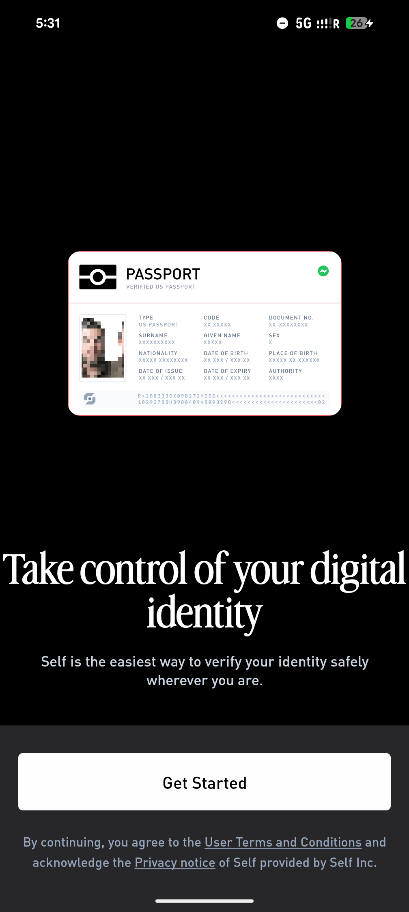
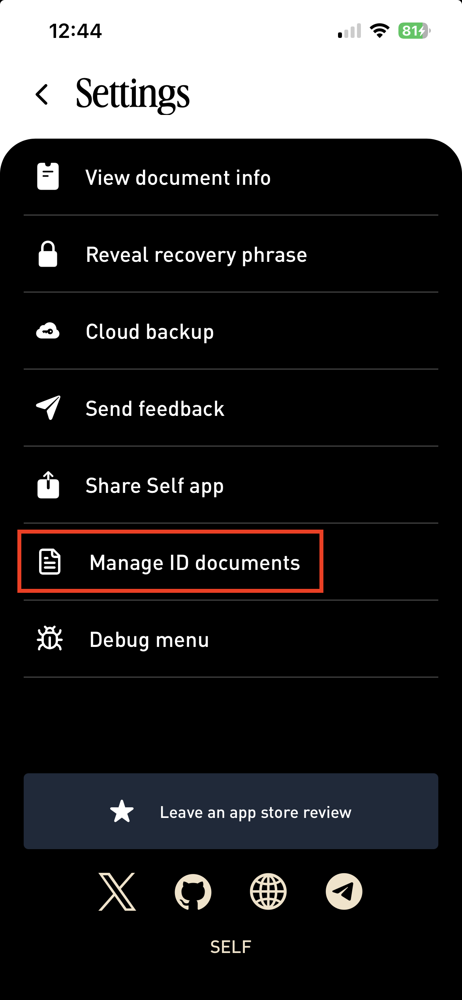
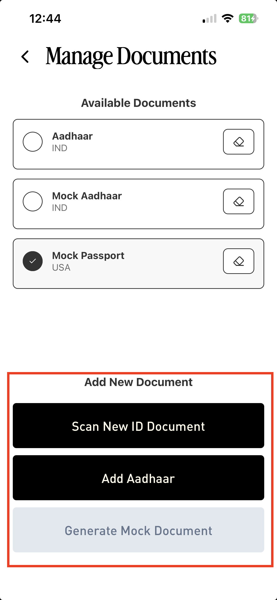

# Using mock passports

When using offchain verification, pass `mockPassport` to the Self verifier as explained [here](https://docs.self.xyz/backend-integration/basic-integration#parameters).

When using onchain verification, use the Sepolia contracts [deployed-contracts.md](../contract-integration/deployed-contracts.md "mention").

## Generating Mock Passport

To create a mock passport, on the first screen, tap 5 times with one finger on the Passport button.

<figure><figcaption></figcaption></figure>

This will show a screen to create a mock passport. To try it out, use [https://playground.staging.self.xyz/](https://playground.staging.self.xyz/) instead of [https://playground.self.xyz/](https://playground.self.xyz/).

To stop using a mock passport, select a different document to use. If no other document is added yet go to the Settings, Select **Manage ID Documents.**

<figure><figcaption></figcaption></figure>

Click **Add New Document.**

<figure><figcaption></figcaption></figure>

If the document is already registered, it can be selected from the Home page.

<figure><figcaption></figcaption></figure>


Two passports registered with the same private key will give the same disclosure nullifier, thus won't be able to e.g. claim an airdrop twice.

If you want to use two passports in prod, you should backup your seed phrase then tap "Delete keychain secrets" before loading a new passport. If later you rescan the previous passport, you'll be able to pass your recovery phrase to recover the corresponding Self identity.

The next versions will support multiple IDs natively.

